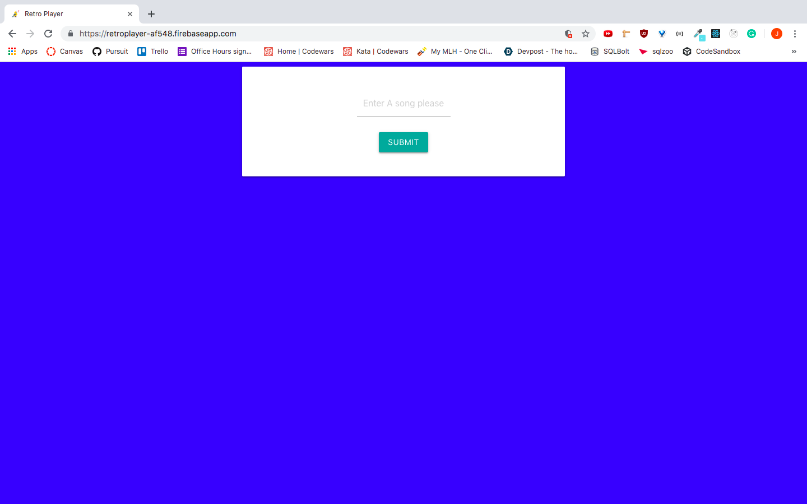
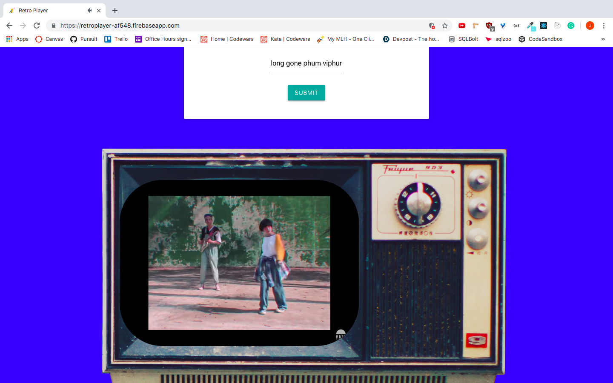

## Youtube Retro Player

### [Link To Live Site](https://retroplayer-af548.firebaseapp.com/)

---

## Minimum Viable Product

---

User will be able to search youtube music video's and load the first video in the queue by autoplaying it.

- Query Search and play all videos relating to the search parameters
- style App to give an old school aesthetics of MTV
- Focus on CSS styling to give the tv the retro Vibe

---

### Version 1:

---

this version only has media queries set up for monitor resolution of 1400X900 and 1920X1080. Will add more resolution sizes on future versions.

---

### How To Use Application:

---

- Enter a song name and artist into the search input field

- Hit submit and then enjoy your music video :)

---

:heart: Jonathan
